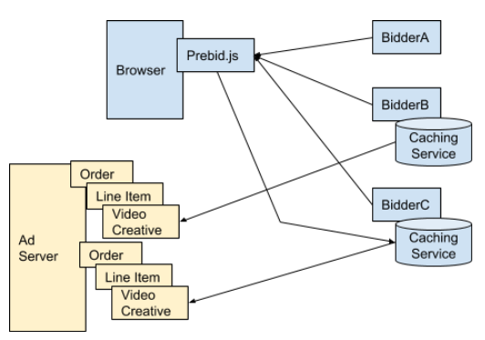
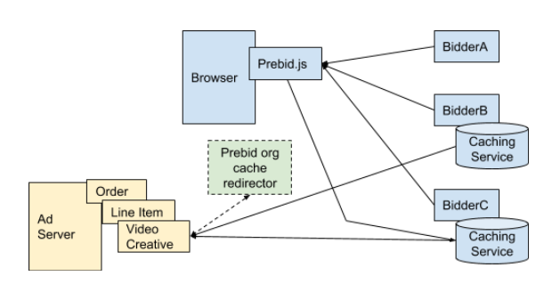

# The Problem

DFP imposes a limit on publishers entering in a video VAST tag URL... the host cannot be a variable. This means that publishers using multiple different video bidders may have to split their line items or at least the creatives to retrieve the VAST from different places.

E.g.

AppNexus requires that the VAST tag URL like:

```
https://prebid.adnxs.com/pbc/v1/cache?uuid=%%PATTERN:hb_uuid%%
```

While Rubicon requires:
```
https://prebid-server.rubiconproject.com/cache?uuid=%%PATTERN:hb_uuid%%
```

Given that macros are possible, it seems like a good solution would be to supply the host and path on the ad request, but this is impossible in DFP, as %% macros cannot be supplied in the host name:

Since bidders should be allowed to decide to be responsible for caching their own assets, we’re stuck in a world where there are different DFP creative instructions for different bidders. Which in turn requires publishers to have different line items or at least creatives.


# Use Cases
Background assumptions:

1. As an exchange that has a caching infrastructure, I want to be able to cache my own VAST XML assets so that I can be responsible for maintaining and troubleshooting my own delivery infrastructure. This means I have a cache retrieval URL other than prebid.adnxs.com.
1. As an exchange that doesn’t have a caching infrastructure for video XML, I need the publisher to cache my XML in a cache of their choice.
1. As a publisher, I’m able to define in Prebid.js which caching service should be used to store video XML for bidders that do not provide their own service.
1. As a publisher, I would like the choice to have only one set of video header bidding line items to simplify ad server setup.
1. In contrast, as a publisher, I would like to be able to break out line items for different video bidders so that I can apply bid discounts if needed.

Here are the scenarios this proposal aims to address.

* As a publisher who has one set of video line items, I need to add additional video bidders, some of whom may have their own caching infrastructure. To simplify the change process and keep my line items clean, I do not want to add or change the creative to support the additional bidder.
* As a publisher who runs a mix of client- and server-side video header bidding, I want to be able to serve both types of integrations with one set of ad server line items.
* As a publisher who has a set of video line items for each bidder, I need to be able to define which bidder wins -- the system should not assume the highest bid always wins.
* As a publisher, I would like to be able to change which caching service I’m using for bidders that don’t provide their own cache, in case I want to improve performance or cost of my existing caching service.

The following diagram shows a scenario where BidderA doesn’t have its own caching service, so Prebid.js caches the VAST XML in BidderC’s caching service. Because there are two caching services being used, the ad server requires at least two separate video creatives -- one that points at BidderB’s caching service and the other at BidderC’s caching service.



# Solution

The solution we chose is for Prebid.org to host a ‘cache redirector’ service. The video creative would point to this service, which then redirects the player to where the cached asset actually resides. Continuing the example from above:



The publisher would be able to enter a constant VAST tag URL like:

```
https://cache.prebid.org/redir?uuid=%%PATTERN:hb_uuid%%&host=%%PATTERN:hb_cache_host%%
```

In the above example, cache.prebid.org is the new service -- it looks at the hb_cachehost variable and redirects the video player to the appropriate place, e.g. prebid.adnxs.com/pbc/v1/cache or prebid-server.rubiconproject.com/cache.

To support the use case of separate line items for each bidder, the VAST tag URL could contain the bidder-specific key-value-pairs:

```
https://cache.prebid.org/redir?uuid=%%PATTERN:hb_uuid_rubicon%%&host=%%PATTERN:hb_cache_host_rubicon%%
```
